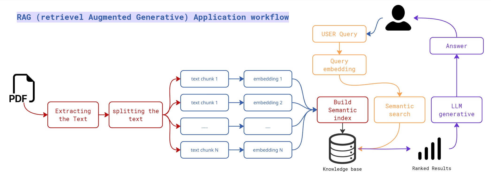

# 🗫 PDF Chat Master – Retrieval-Augmented Generation (RAG) App  

Chat with your PDFs like never before!  
This application uses **Retrieval-Augmented Generation (RAG)** to let you upload a PDF, process it into a knowledge base, and ask questions with answers generated by a Large Language Model (LLM).  
---

---
### feel free to test the application : ``https://huggingface.co/spaces/dudeawsome0me/Rag_app_Chat_pdf``

## 🚀 Features  
- 📝 Upload any PDF and view it directly in the app  
- 🔍 Extract and split text into meaningful chunks  
- 📚 Build a semantic knowledge base using **HuggingFace embeddings** and **FAISS**  
- 🤖 Ask natural language questions and get context-aware answers powered by **Google Gemini**  
- 🎨 Modern, polished UI built with **Streamlit**  

---

## 🛠️ Tech Stack  
- **Frontend**: Streamlit  
- **Embeddings**: HuggingFace (`all-MiniLM-L6-v2`)  
- **Vector Store**: FAISS  
- **LLM**: Google Gemini (`gemini-2.5-flash`) via `langchain_google_genai`  
- **Other Tools**: PyPDF2, LangChain, dotenv  

---

## 📂 Project Structure  
/rag-pdf-chat
┣ 📁 data/ # PDFs and knowledge base
┣ 📄 app.py # Main Streamlit app
┣ 📄 functions.py # Helper functions (processing, embeddings, QA)
┣ 📄 requirements.txt # Dependencies
┣ 📄 .env # Gemini API Key
┗ 📄 README.md
